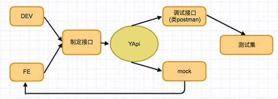

## GApi  可视化接口管理平台

体验地址：

文档：

### 平台介绍
YApi 堆积大量 issue 没有解决，不再维护。作为后端开发者更青睐 Go，程序员总想自己造轮子，嫌弃别人造的轮子不好用，于是产生的这个项目。

YApi 前端React， 后端 Nodejs，数据库  Mongodb
GApi 前端Vue3

直接原因是我在寻找 API 接口测试工具的时候没有找到方便好用的
- Postman 客户端越来越大，每次打开弹窗提示烦我
- Postwoman 太轻量，不能在线保存接口
- Jetbrains Http Client 强依赖 Jetbrains 平台，而且代码/Run/httpClient 界面点来点去
- ApiPost 不能导出接口数据，想通过这种方式强留用户

我想要的工具有如下特点：
- 支持内网部署，依赖尽可能少。为了个接口管理加上个 mysql/mongodb 没什么作用，难道还有高并发？
- 文档和接口一起，接口即文档
- 支持自动化测试
- 支持 mock 数据

GApi 是<strong>高效</strong>、<strong>易用</strong>、<strong>功能强大</strong>的 api 管理平台，旨在为开发、产品、测试人员提供更优雅的接口管理服务。可以帮助开发者轻松创建、发布、维护 API，YApi 还为用户提供了优秀的交互体验，开发人员只需利用平台提供的接口数据写入工具以及简单的点击操作就可以实现接口的管理。

### 特性
*  基于 Json5 和 Mockjs 定义接口返回数据的结构和文档，效率提升多倍
*  扁平化权限设计，即保证了大型企业级项目的管理，又保证了易用性
*  类似 postman 的接口调试
*  自动化测试，支持对 Response 断言
*  MockServer 除支持普通的随机 mock 外，还增加了 Mock 期望功能，根据设置的请求过滤规则，返回期望数据
*  支持 postman, har, swagger 数据导入
*  免费开源，内网部署，信息再也不怕泄露了

### 内网部署
#### 环境要求
* go（1.15+)
* sqlite
* git
#### 安装

    

    
### 教程

### Authors
* [xushuhui](https://github.com/xushuhui)

### Thanks
[YApi](http://yapi.smart-xwork.cn/)

### License
Apache License 2.0
